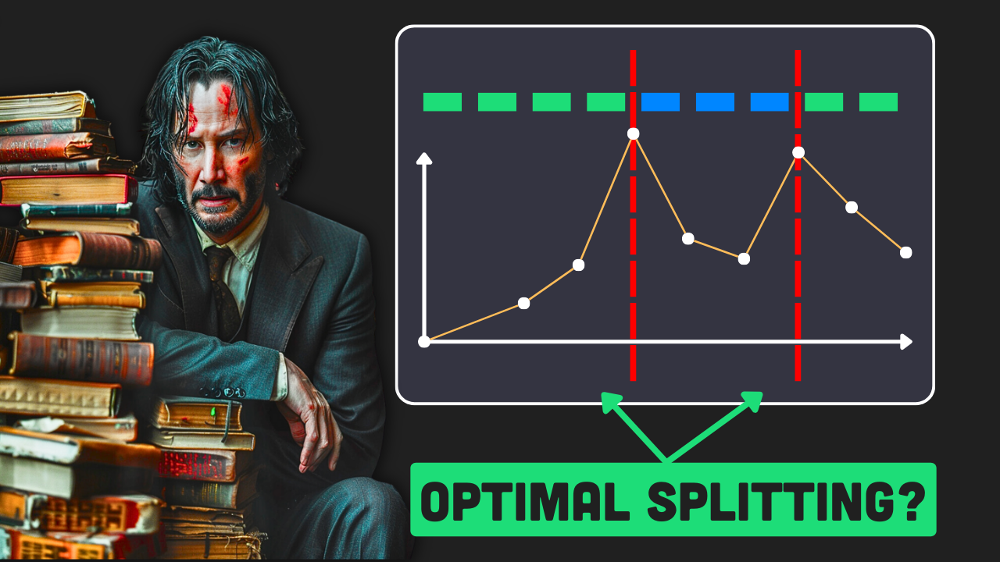

# Semantic Splitting

This tutorial is available on my YouTube channel:

[](https://www.youtube.com/watch?v=VSfehUJUWQY)
[YouTube Video](https://www.youtube.com/watch?v=VSfehUJUWQY).

## Overview

This project provides a Python implementation of **Semantic Splitting**: a powerful technique for optimizing document segmentation in language models, especially useful in retrieval-augmented generation tasks. By analyzing the semantic relationships within text, it can automatically identifies the best points to split documents, enhancing the performance and relevance of language model responses.

## Features

- **Automated** semantic analysis for intelligent document splitting.
- **Easy integration** with popular language models like GPT-4.
- **Complete** Python notebook for end-to-end implementation.
- **Embedding** calculations and **divergence** plotting for optimal segmentation.
- **Peak detection** for identifying precise splitting points.

## Getting Started

To start using the tutorial, clone this repository and install the required dependencies using poetry:

```
git clone repo
cd repo
poetry install
```

## Prerequisites

Ensure you have the following installed on your system:

- Python 3.12 or later
- Poetry for dependency management

## Tutorial Structure

The tutorial is divided into executable Jupyter notebooks, each focusing on different aspects of using Magentic with LiteLLM:

1. **1_semantic_splitting.ipynb**: Semantic splitting by example.

## Support and Contribution

For questions, support, or to contribute to this tutorial, please open an issue or pull request on the GitHub repository. I welcome contributions that help enhance and clarify the content.
